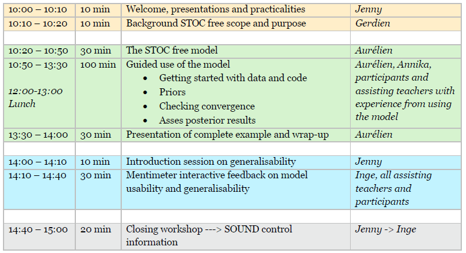

# STOC free workshop 2020

## Objectives

At the end of the workshop, participants should be able to:

* understand what is freedom from disease and its importance in animal trade
* understand the added value of output-based surveillance for substantiating freedom from disease
* understand how the STOC free model represents longitudinal surveillance data
* apply the STOC free model to longitudinal surveillance data

Feedback we would like to get from participants:

* applicability of the model 

* ease of use of the R package and suggestions for improvement

  

## Workshop outline

