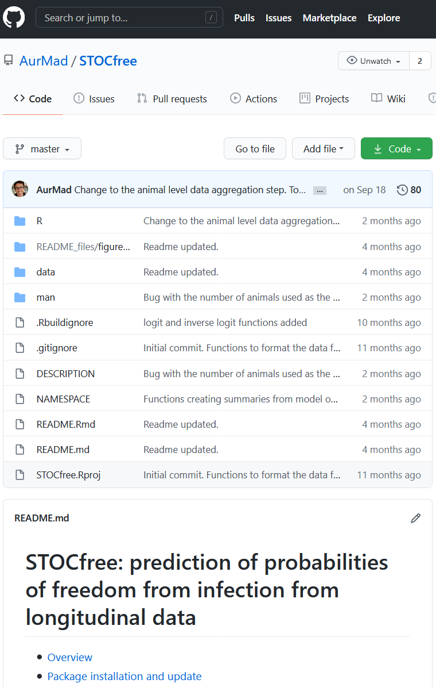

```{r, include = FALSE}
knitr::opts_chunk$set(cache = TRUE)
```

# Aims of the session

- At the end of the session, participants should:
 - Be able to use the `STOCfree` package to predict herd level probabilities of infection
 - Understand the basics of how estimation and prediction are performed
 - Understand and explore model outputs

 
- Feedback we would like from the participants:
 - Suitability of the model for longitudinal surveillance data
 - Features that are missing or that need improvement
 - Any suggestion that could help making the package more useful
 

---
# Programme of the session

1. Introduction to the `STOCfree` package

1. Modelling of herd level data using test results only

1. Modelling of herd level data using test results and a risk factor

1. Modelling of animal level data

---
class: inverse, center, middle

# The STOCfree package

---
# The STOCfree package

- `R` + `JAGS` implementation of the STOC free model

- set of functions to build, run and analyse the output gathered in an `R` package

- package hosted and documented on Github

.center[https://github.com/AurMad/STOCfree]

---

---
# The STOCfree package

- package description and tutorial at the bottom of the page (README)

- R folder: R scripts defining the functions provided in the package

 - `write_JAGS_model.R`: JAGS models

 - `STOCfree_data.R`: building of STOCfree_data objects

---
# STOCfree package dependencies

- `JAGS` version 4.3: estimation of model parameters and prediction

.center[https://sourceforge.net/projects/mcmc-jags/files/]

- R packages

 - `rjags`: interfaces R with JAGS
 - `coda`: processes JAGS output
 - `dplyr`, `tibble`: data manipulation in R
 - `tidybayes`: processing of JAGS output using the tidy syntax

---
# Installing the STOCfree package from Github

- The STOCfree package needs to be installed from Github using the `install_github()` function from the `devtools` package

```{r installing the STOCfree package, eval = FALSE}
## attaching the devtools package
library(devtools)

## installing the package
install_github("AurMad/STOCfree")
```

---
# Setting up the R session

- The different packages we will use
 - STOCfree
 - tidyverse
 - ggplot2

```{r packages, message = FALSE}
library(STOCfree)
library(tidyverse)
library(ggplot2)
```

---
class: inverse, center, middle

# Modelling herd level data
# Test results only

---
# The herdBTM dataset

- Included in the `STOCfree` package as an example of herd level data
- Represents herd level bulk tank milk BVDV antibody testing
- Data collected approximately every 6 months in every herd

```{r herdBTM data}
head(herdBTM)
```

---
# The herdBTM dataset

- The different columns are:
 - **`Farm`**: farm ID
 - **`DateOfTest`**: date of test
 - **`ODR`**: test result as a continuous value (optical density ratio)
 - **`Test`**: test used. Either `BTM_ODR` for optical density ratio on bulk tank milk, or `confirm` for confirmatory testing
 - **`TestResult`**: ODR value categorised as negative (ODR < 35) or positive (ODR $\geq$ 35)
 - **`LocalSeroPrev`**: local seroprevalence, i.e. prevalence of test positive in the neighbourhood

---
# The herdBTM dataset

- We will only use results from `BTM_ODR` tests and store the resulting object in a variable called `bvd`

```{r creation of bvd dataset}
bvd <- herdBTM %>%
  filter(Test == 'BTM_ODR') %>%
  select(Farm, DateOfTest, ODR, TestResult, LocalSeroPrev)
```

---
# Steps of the analysis

1. Build a `STOCfree_data` object from surveillance data

1. Define prior distributions for test characteristics

1. Define prior distributions for status dynamics

1. Compile the model

1. Sample from the model

1. Process and analyse model output

---
# Building a STOCfree_data object

- Type `?STOCfree_data` to see the function's help page

- We will first run the model using test results only

- Using the `bvd` dataset:

```{r building STOCfree_data object}
sfd <- STOCfree_data(
  test_data = bvd,
  test_herd_col = "Farm",
  test_date_col = "DateOfTest",
  test_res_col = "TestResult",
  test_level = "herd")
```

---
# STOCfree_data objects' structure

```{r}
str(sfd, max.level = 1)
```

---
# STOCfree_data objects' structure

- Column names correspondence between STOCfree_data objects and original dataset

```{r STOCfree_data var_names}
sfd$var_names
```

---
# STOCfree_data objects' structure

- Herds numbered from 1 to number of herds

- Correspondence between original herd id and herd id used by the model stored in the `STOCfree_data` object

```{r STOCfree_data herd_id_corresp, eval = FALSE}
sfd$herd_id_corresp
```

```{r STOCfree_data herd_id_corresp_1, echo = FALSE}
sfd$herd_id_corresp[1:10,]
```

---
# STOCfree_data objects' structure

- Test data:

```{r STOCfree_data test_data, eval = FALSE}
sfd$herd_test_data
```

```{r STOCfree_data test_data_1, echo = FALSE}
sfd$test_data[1:10,]
```

 - Can you guess what the different columns correspond to?

---
# STOCfree_data objects' structure

- Check the original data:

```{r extract data herd i, eval = FALSE}
## for herd_id i, Farm is
i <- 1
herd_id_i <- sfd$herd_id_corresp$Farm[sfd$herd_id_corresp$herd_id == i]

## extracting herd data
bvd %>%
  filter(Farm == herd_id_i) %>%
  View()
```

---
# STOCfree_data objects' structure

- herd_test_data
 - Contains index (`status_id`) of first and last test for each month

```{r herd_test_data, eval = FALSE}
sfd$herd_test_data
```

```{r herd_test_data_1, echo = FALSE}
sfd$herd_test_data[1:10,]
```

---
# STOCfree_data objects' structure

- Prior distributions for test characteristics
 - Beta distributions
 - Need to specify $\alpha$ and $\beta$ parameters for sensitivity and specificity

```{r}
sfd$test_perf_prior
```

- Here, 1 row because only 1 test present in the dataset

- What would be good priors for our test?

---
# Visualising Beta distributions

- `betadistapp` package
 - shiny app
 - displays $\alpha$ and $\beta$ for Beta distributions plotted using sliding scales for mean and sd
 - plots Beta distributions using $\alpha$ and $\beta$ as inputs

- install the package
```{r install betadistapp, eval = FALSE}
devtools::install_github("AurMad/betadistapp")
```

- run the app

```{r run shiny_beta, eval = FALSE}
betadistapp::shiny_beta()
```

---
# Prior distributions for test characteristics

- Prior distributions specified using the `set_priors_tests()` function

```{r}
sfd <- set_priors_tests(sfd,
                 Se_a = 5000,
                 Se_b = 260,
                 Sp_a = 9000,
                 Sp_b = 1000)
```

---
# Prior distributions for test characteristics

- Check that the `STOCfree_data` object has been updated

```{r}
show_tests(sfd)
```

---
# Prior distributions for test characteristics

- Plot the prior distributions for test characteristics

```{r plot test characteristics, fig.height = 5}
plot_priors_tests(sfd)
```

---
# Prior distributions for infection dynamics

- We need prior Beta distributions for:
 - probability of infection on the first test ( $\pi_1$ )
 - probability of new infection between consecutive months ( $\tau_1$ )
 - probability of not eliminating the infection between consecutive months ( $\tau_2$ )

```{r infection dynamics priors}
sfd$inf_dyn_priors
```

---
# Prior distributions for infection dynamics

- Prior distributions are set using the `set_priors_inf_dyn`

```{r set infection dynamics priors}
sfd <- set_priors_inf_dyn(sfd,
                   pi1_a = 1,
                   pi1_b = 1,
                   tau1_a = 1.5,
                   tau1_b = 10,
                   tau2_a = 10,
                   tau2_b = 1.5)
```

---
# Prior distributions for infection dynamics

- Parameters of the prior distributions can be checked with the `show_inf_dyn()` function

```{r show infection dynamics priors}
show_inf_dyn(sfd)
```

---
# Prior distributions for infection dynamics

- Prior distributions are plotted with the `plot_priors_inf_dyn()` function

```{r plot infection dynamics priors, fig.height = 5}
plot_priors_inf_dyn(sfd)
```

---
# Model compilation

- Using the `compile_JAGS()` function:

```{r JAGS model compilation, eval = TRUE}
compiled_model <- compile_JAGS(sfd,
                               n_chains = 4,
                               keep_model_file = TRUE)
```

---
# Model compilation

- The function sends our model, data and priors to JAGS

- The model corresponding to our specifications is written into a text file that will be used by JAGS:
 - herd level
 - no risk factor
 - stored in a file called `JAGS_model.txt` in your working directory (because we used the argument `keep_model_file = TRUE`)

---
# Model sampling

- The aims are to obtain:
 - samples from the posterior distributions of the model parameters
 - distributions of predicted probabilities of infection for each herd in the data

```{r sampling from JAGS model, eval = TRUE}
samples <- sample_model(compiled_model,
                        n_burnin = 5000,
                        n_iter = 5000,
                        n_thin = 20)
```

---
# Model outputs

- The output consists of 3 parts:
 - `parameters`: model parameters (Se, Sp, $\ldots$ )
 - `proba_inf`: herd level predicted probabilities of infection
 - `Gelman_diag`: results of Gelman-Rubin convergence diagnostics performed on model parameters

```{r, eval = FALSE}
str(samples, max.level = 1)
```

---
# Model outputs

- Model outputs should be saved on the disk
 - You usually do not want to re-run several hours of analysis !

- We store the 3 components of the JAGS output
 - as 3 csv files
 - in a folder called model_output

```{r creates folder to store model output if not present, eval = FALSE, include = FALSE}
if(!"./model_output" %in% list.dirs()) dir.create("model_output")
```

```{r writing JAGS output to disk, eval = FALSE}
write.csv(samples$parameters, "model_output/param.csv", row.names = FALSE)
write.csv(samples$proba_inf, "model_output/proba_inf.csv", row.names = FALSE)
write.csv(samples$Gelman_diag, "model_output/Gelman_diag.csv", row.names = FALSE)
```

---
# Convergence diagnostics

- Gelman-Rubin diagnostics
 - computed using the `gelman.diag()` function from the `coda` package
 - should be close to 1

```{r Gelman-rubin diagnostics}
Gelman_diag <- read.csv("model_output/Gelman_diag.csv")

Gelman_diag
```

---
# Model parameters

- Samples from the posterior distributions of the different model parameters

```{r}
param <- as_tibble(read.csv("model_output/param.csv"))

head(param)
```

---
# Model parameters

- Convergence can be evaluated using traceplots

```{r parameter traceplots, fig.height = 5}
ggplot(param, aes(x = .iteration, y = Se, col = factor(.chain))) +
  geom_line()
```

---
# Model parameters

- Densities can be visualised

```{r posterior parameter density, fig.height = 4.5}
ggplot(param, aes(x = Se, colour = "Posterior")) +
  stat_density(geom = "line") +
  geom_function(fun = dbeta, args = list(5000, 260), aes(colour = "Prior")) +
  scale_colour_discrete(name  ="")
```

---
# Model parameters

- Summaries for all model parameters:

```{r}
param_summary(x = param)
```


---
# Predicted probabilities of infection

- Samples from the predicted probabilities of infection for the different herds

```{r loading predicted probabilities of infection}
pinf <- as_tibble(read.csv("model_output/proba_inf.csv"))

head(pinf)
```

---
# Predicted probabilities of status positive

- Density for the overall probability of status positive

```{r plotting overall predicted probabilities of infection, fig.height = 5}
ggplot(pinf, aes(x = predicted_proba)) +
  geom_density()
```

---
# Predicted probabilities of status positive

- Density for every herd

```{r plotting predicted probabilities of infection for each herd individually, fig.height = 5}
ggplot(pinf, aes(x = predicted_proba, col = factor(herd_id))) +
  geom_density() +
  theme(legend.position = "none")
```

---
# Predicted probabilities of status positive

- Density for specific herds
 - herd 29: negative test results only

```{r}
sfd$test_data %>%
  filter(herd_id == 29)
```

---
# Predicted probabilities of status positive

- Density for specific herds
 - herd 29: negative test results only

```{r plotting predicted probabilities of infection for herd 29, fig.height = 4}
pinf %>%
  filter(herd_id == 29) %>%
  ggplot(., aes(x = predicted_proba, col = factor(herd_id))) +
  geom_density()
```

---
# Predicted probabilities of status positive

- Density for specific herds
 - herd 30: positive test results only

```{r}
sfd$test_data %>%
  filter(herd_id == 30)
```

---
# Predicted probabilities of status positive

- Density for specific herds
 - herd 30: positive test results only

```{r plotting predicted probabilities of infection for herd 30, fig.height = 4}
pinf %>%
  filter(herd_id == 30) %>%
  ggplot(., aes(x = predicted_proba, col = factor(herd_id))) +
  geom_density()
```

---
# Predicted probabilities of status positive

- Density for specific herds
 - herd 68: negative and positive test results

```{r}
sfd$test_data %>%
  filter(herd_id == 68)
```

---
# Predicted probabilities of status positive

- Density for specific herds
 - herd 68: negative and positive test results

```{r plotting predicted probabilities of infection for herd 68, fig.height = 4}
pinf %>%
  filter(herd_id == 68) %>%
  ggplot(., aes(x = predicted_proba, col = factor(herd_id))) +
  geom_density()
```

---
# Predicted probabilities of status positive

- Density for specific herds
 - herd 68: negative and positive test results

### Explaining bi-modality:
- herd tested negative on month 32
- latent status on month 32
 - on some iterations, latent status sampled as negative $\rightarrow$ predicted probability of infection on month 33 is $\tau_1$
 - on some iterations, latent status sampled as positive $\rightarrow$ predicted probability of infection on month 33 is $\tau_2$

---
# Predicted probabilities of status positive

- Density for specific herds
 - herd 83: latest test results is positive

```{r}
sfd$test_data %>%
  filter(herd_id == 83)
```

---
# Predicted probabilities of status positive

- Density for specific herds
 - herd 83: latest test results is positive

```{r plotting predicted probabilities of infection for herd 83, fig.height = 4}
pinf %>%
  filter(herd_id == 83) %>%
  ggplot(., aes(x = predicted_proba, col = factor(herd_id))) +
  geom_density()
```

---
# Predicted probabilities of status positive

- Density for specific herds
 - herds 29, 30, 68 and 83

```{r plotting predicted probabilities of infection for 4 herds, fig.height = 4}
pinf %>%
  filter(herd_id %in% c(29, 30, 68, 83)) %>%
  ggplot(., aes(x = predicted_proba, col = factor(herd_id))) +
  geom_density()
```

---
# Categorisation of herds into status negative / positive

- Need to get from a probability distribution to negative / positive for each herd

- Solution currently explored:
 - summarise each herd probability distribution with a quantile (e.g. median)
 - set a threshold below which herds are categorised as negative and above which they are positive
 - implemented in the `herd_summary()` function

---
# Categorisation of herds into status negative / positive

- test

```{r summary of distributions for predicted probabilities of infection}
hrd_prob <- herd_summary(pinf, sfd, quantile = 0.5, cut_off = 0.5)

head(hrd_prob)
```


---
class: inverse, center, middle

# Modelling herd level data
# Test results and risk factors

---
# Risk factors of new infection

- Risk factors could improve detection:

 - As an addition to test results
 - When recorded between tests

--

- Which risk factors to include?

 - known from the literature
 - associated to new infection in the data

--

- What delay between risk factors and new infection?
 - There could be some time between exposure to a risk factor and becoming infected

---
# Risk factors of new infection

- Not possible to evaluate all possible associations using the STOC free model
 - Bayesian inference is too time consuming!

--

.center[]

.footnote[[1] https://twitter.com/ChelseaParlett/status/1296490493539487745]


---
# Evaluation of risk factors of new infection using surveillance data

- Different functions implemented in the package to help evaluating putative associations

- These functions rely on the R `glm()` function
 - Logistic models
 

---
# Association number of cattle purchased - seroconversion

- Here, we will estimate associations between the number of animal purcahsed and seroconversion from the available data

--

- In the case of BVD
 - Possible delay between cattle purchase and the birth of persistently infected calves
 - What is the best time delay to use?

- This is investigated using the `intro` dataset included in the package

---
# The intro dataset

- Included in the `STOCfree` package

- Same herds as in the `herdBTM` dataset

- Number of cattle introduced per herd

```{r intro dataset}
head(intro)
```

---
# The logit_nwinf_lagged() function

- Probability of becoming positive between consecutive tests modelled as a function of a risk factor using logistic regression

- Considers all sequences of 2 consecutive tests where the $1^{st}$ test is negative

- Within a given range, all possible intervals between exposure to risk factor and outcome modelled

- AICs of the different models are reported for the identification of the best interval

---
# Association number of cattle purchased - seroconversion

- Natural logarithm of number of cattle used (better fit)

```{r association cattle introductions and seroconversion}
intro$ln_nAnim <- log(intro$nAnim + 1)

nAnim_lagged <- logit_nwinf_lagged(
  sf_data = sfd,
  rf_data = intro,
  rf_date_col = "dateIntr",
  rf_col = "ln_nAnim",
  time_of_inf = "mid",
  lag1 = 0,
  lag2 = 24)

head(nAnim_lagged)
```


---
# Association number of cattle purchased - seroconversion

- Plot of the results: best interval = 8 to 8

```{r, plot of associations cattle introduced and seroconversion, fig.height = 4}
ggplot(data = nAnim_lagged, aes(x = lag2, y = lag1, fill = AIC)) +
  geom_tile() +
  xlab("Time Lag 2 (months)") + ylab("Time Lag 1 (months)") +
  scale_fill_gradient(low = "red", high = "yellow", aesthetics = "fill") +
  ggtitle("Number of animals purchased")
```

---
# Association local serporevalence - seroconversion

- Same idea as above
 - Maximum of the local prevalence over the considered interval

```{r association local seroprevalence seroconversion, warning = FALSE}
lsprev <- logit_nwinf_lagged(
  sf_data = sfd,
  rf_data = bvd,
  rf_date_col = "DateOfTest",
  rf_col = "LocalSeroPrev",
  time_of_inf = "mid",  lag1 = 0, lag2 = 24,
  FUN = max)
```

---
# Association local serporevalence - seroconversion

- Plot of the results

```{r plot association local seroprevalence seroconversion, echo= FALSE, fig.height = 4}
ggplot(data = lsprev, aes(x = lag2, y = lag1, fill = AIC)) +
  geom_tile() +
  xlab("Time Lag 2 (months)") +
  ylab("Time Lag 1 (months)") +
  scale_fill_gradient(low = "red", high = "yellow", aesthetics = "fill") +
  ggtitle("Local seroprevalence")
```

- Best interval: 5 to 5


---
# Multivariate logistic model

- Objective: evaluate associations between risk factors identified at the previous step and probability of becoming status positive

- Creation of the outcome dataset

```{r make nwinf}
nwinf <- make_nwinf_data(sfd,
                         time_of_inf = "mid")
```


---
# Multivariate logistic model

- Structure of the object

```{r structure of nwinf}
str(nwinf)
```

---
# Multivariate logistic model

- Adding lagged risk factors

```{r add risk factors to STOCfree data}
nwinf <- add_risk_factor(nwinf,
                         intro,
                         rf_col = "ln_nAnim",
                         rf_date_col = "dateIntr",
                         lag1 = 8,
                         lag2 = 8)

nwinf <- add_risk_factor(nwinf,
                         bvd,
                         rf_col = "LocalSeroPrev",
                         rf_date_col = "DateOfTest",
                         lag1 = 5,
                         lag2 = 5)
```

---
# Multivariate logistic model

- Structure of the object

```{r}
str(nwinf)
```

---
# Multivariate logistic model

- Model

```{r, warning = FALSE}
modl <- logit_nwinf(nwinf,
                    risk_factors = c("ln_nAnim_8_8", 
                                     "LocalSeroPrev_5_5"))
```

---
# Multivariate logistic model

- Model results

```{r}
summary(modl)
```

---
# Including risk factors in the STOCfree model

- ln(number animals purchased + 1) is added to the model

- This is done by updating the STOCfree_ data object

```{r risk factor added to the STOCfree_data object}
sfd <- sf_add_risk_factor(
  sfd = sfd,
  risk_factor_data = intro,
  risk_herd_col = "Farm",
  risk_date_col = "dateIntr",
  risk_factor_col = "ln_nAnim",
  risk_factor_type = "continuous",
  lag1 = 8,
  lag2 = 8,
  FUN = sum)
```

---
# Including risk factors in the STOCfree model

- Consequence:
  - $\tau_1$ is not a model parameter anymore

```{r tau1 discarded when risk factor included to STOCfree_data}
show_inf_dyn(sfd)
```

---
# Including risk factors in the STOCfree model

- Consequences:
 - logistic regression for $\tau_{1t}$
 - need to specify prior distributions for the logistic regression
 
```{r prior distribution for logistic regression}
show_rf(sfd)
```

---
# Prior distributions for the logistic regression

- Logistic regression

$$ln(\frac{\tau_{1t}}{1-\tau_{1t}}) = \theta_1 + \theta_2 x_t$$

- Regression intercept 
 - log-odds of infection in the reference modality
 - here, when the number of purchased animals is 0
 
- Coefficients
 - increase in log-odds of new infection per unit of increase in the variable
 - here, increases per unit increase in ln(numeber animals + 1)

---
# Prior distributions for the logistic regression

- Logistic regression

$$ln(\frac{\tau_{1t}}{1-\tau_{1t}}) = \theta_1 + \theta_2 x_t$$

- Prior distributions

$$\theta_1 \sim \mathcal{N}(\mu_1, \sigma^2_1)$$

$$\theta_2 \sim \mathcal{N}(\mu_2, \sigma^2_2)$$

---
# Prior distributions for the logistic regression

- What are reasonable values for the $\theta$s?

```{r, echo = FALSE, fig.height = 5}
curve(invlogit(x),
      from = -5, to = 5,
      xlab = "logit(p)",
      ylab = "p",
      lwd = 2)
grid()
```

---
# Setting the prior distributions for the risk factors of new infection

- Intercept
 - mean set to -3 which corresponds to a probability of `r round(STOCfree::invlogit(-3), 3)` for herds introducing no animal
 
- ln(number animals)+ 1
 - mean set to 0: assumes an absence of effect. 
 - Posterior driven by the data

```{r set prior distributions risk factors}
sfd <- set_priors_rf(sfd,
                   risk_factor = "Intercept",
                   mean = -3, sd = 1)


sfd <- set_priors_rf(sfd,
                   risk_factor = "ln_nAnim_8_8",
                   mean = 0, sd = 2)
```

---
# Setting the prior distributions for the risk factors of new infection

- The `STOCfree_data` object has been updated

```{r display prior distributions risk factors}
show_rf(sfd)
```

---
# Setting the prior distributions for the risk factors of new infection

- The `STOCfree_data` object has been updated

```{r display risk factor data}
sfd$risk_factor_data[c(1:10, 30:40),]
```


---
# Setting the prior distributions for the risk factors of new infection

- The prior distributions can be plotted

```{r plot prior distributions risk factors, fig.height= 5}
plot_priors_rf(sfd)
```

---
# Model compilation

- Same as previously

```{r compiling JAGS model with risk factors}
compiled_model1 <- compile_JAGS(sfd,
                               n_chains = 4,
                               keep_model_file = TRUE)
```

---
# Model sampling

- Same as previously

```{r sampling from JAGS model with risk factors}
samples <- sample_model(compiled_model1,
                        n_burnin = 5000,
                        n_iter = 5000,
                        n_thin = 20)
```

---
# Model results saved

- Same as previously

```{r saving results of model with risk factors}
write.csv(samples$parameters, "model_output/rf_param.csv", row.names = FALSE)
write.csv(samples$proba_inf, "model_output/rf_proba_inf.csv", row.names = FALSE)
write.csv(samples$Gelman_diag, "model_output/rf_Gelman_diag.csv", row.names = FALSE)
```

---
# Model parameters

```{r parameters of model with risk factors}
param1 <- as_tibble(read.csv("model_output/rf_param.csv"))

param_summary(x = param1)
```

---
# Predicted probabilities of infection

```{r, fig.height = 5}
pinf1 <- as_tibble(read.csv("model_output/rf_proba_inf.csv"))

ggplot(pinf1, aes(x = predicted_proba)) +
  geom_density()
```

---
class: inverse, center, middle

# Questions ?
# Remarks ?


---
background-image: url(./imgs/last_slide.png)
background-size: contain
